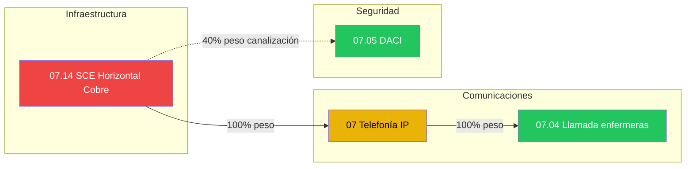
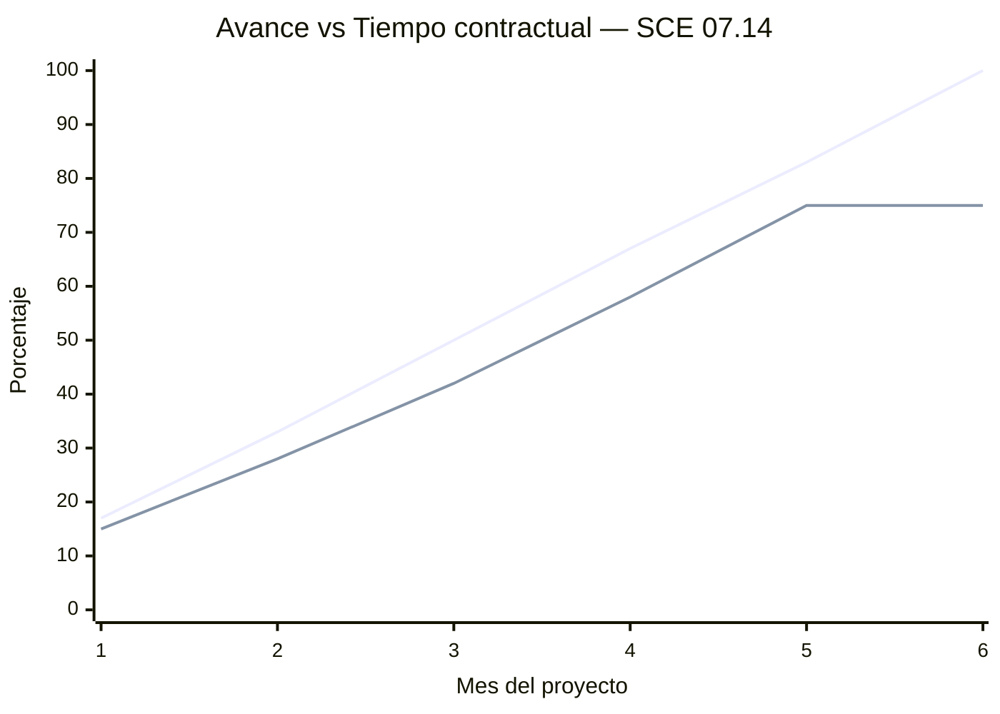
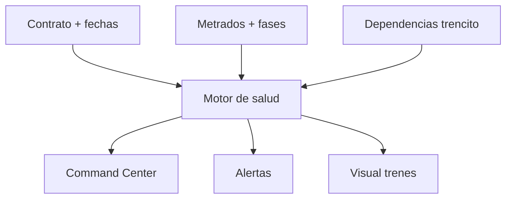

# Diagramas — Trencitos de dependencia

**Proyecto demo:** Hospital IntegraCom  
**Spec:** [03-avance-obra-module.md](../specs/03-avance-obra-module.md)

---

## 1. Inter-sistema (vista gerencia)

**Leyenda demo (estado en seed):**
- 🔴 SCE — rezagado vs contrato (cuello de botella)
- 🟡 Telefonía — atención por upstream
- 🟢 Enfermeras / DACI — ok relativo (dependen parcialmente de SCE)

---

## 2. Intra-sistema — SCE horizontal cobre (7 fases)

**Lectura gerencial:** cuello de botella en **ROTULADO** (muchas salidas sin rotular bloquean certificación aguas abajo).

---

## 3. Cruce tiempo × avance (concepto)

**Día equivalente ~5.5:** 75 % avance vs ~92 % tiempo → 🔴 MAL (penalidad).

---

## 4. Flujo de datos (demo)

---

## 5. Ficha técnica vs avance (alcance)

**MVP implementa solo** bloque central (metrado → avance → visualización).
